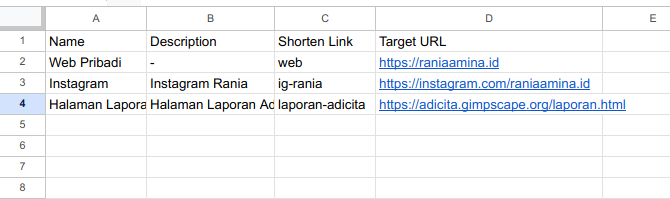
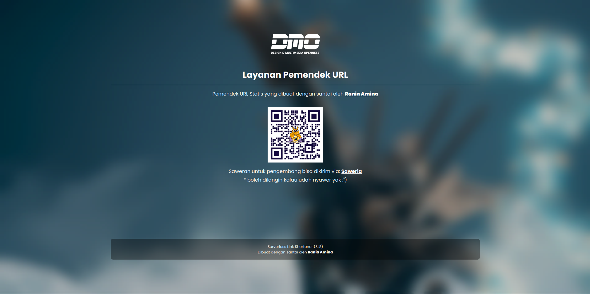
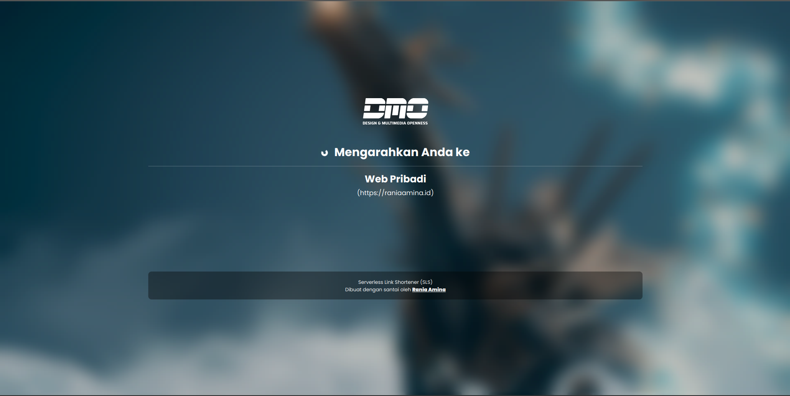

# Serverless Link Shortener by Rania Amina
Pemendek URL personal yang dapat kamu host sendiri dan pakai suka-suka kamu!

## Persiapan
- Silakan buat Google Sheet (gsheet) yang akan digunakan sebagai sumber data.
- Buat tabel dengan kolom sebagai berikut;  
"Name; Description; Shorten Link; Target URL", silakan lihat tangkapan layar di bawah untuk lebih jelasnya.
- Pastikan gsheet ini dapat diakses publik dengan izin Read Only.
- Ambil kode gsheet yang berada di URL gsheet Anda; https://docs.google.com/spreadsheets/d/`KODE_GSHEET_DI_SINI`/ (contoh: URL gsheet Anda `https://docs.google.com/spreadsheets/d/1Jy72k-ha828TrJqsjaKX2vq2mVoIm00oMUh9gW2TFfI/edit`, maka ID Gsheet Anda adalah `1Jy72k-ha828TrJqsjaKX2vq2mVoIm00oMUh9gW2TFfI` )
- Masukkan kode Gsheet di atas ke dalam berkas `assets/js/config.json`, pastikan Anda mengapitnya dengan tanda petik.

## Penggunaan
- Pastikan Anda telah membuat tabel pada Google Sheet pada langkah persiapan sebelumnya.
- Silakan isi data pada tabel Google Sheet Anda;   
    Name: Nama Situs Tujuan  
    Description: Deskripsi ringkas (isi dengan - bila tidak ingin mengisi field ini)  
    Shorten Link: ID shorten link, harap jangan menambahkan spasi pada field ini  
    Target URL: URL lengkap (lengkapi dengan http/https) ke Situs Tujuan  
    Harap diingat, __jangan pernah membiarkan cell kosong pada tiap baris data__.  
    Silakan lihat pada tangkapan layar untuk lebih jelasnya.
- Shortenlink dapat Anda akses dengan format;  
    `https://domain-anda.id/#/ID-SHORTEN-LINK`  
    contoh: https://e.kuwi.my.id/#/laporan-adicita

- Serve halaman di layanan favorit Anda.

## Tangkapan Layar

Pengaturan Tabel

Halaman Depan

Halaman Redirect

Halaman 404

## Penyangkalan
Proyek ini dibuat dengan santai oleh Rania Amina dengan tanpa memberikan jaminan atau garansi apapun kepada para pengguna. Silakan gunakan dengan kesadaran penuh bahwa Anda bertanggung jawab dengan segala risiko atau dampak baik positif maupun negatif yang ditimbulkan akibat dari penggunaan layanan ini.

## Sawer Project
Suka dengan proyek ini? Kirim saweran Anda untuk pengembang melalui; [Saweria](https://saweria.co/raniaamina).
